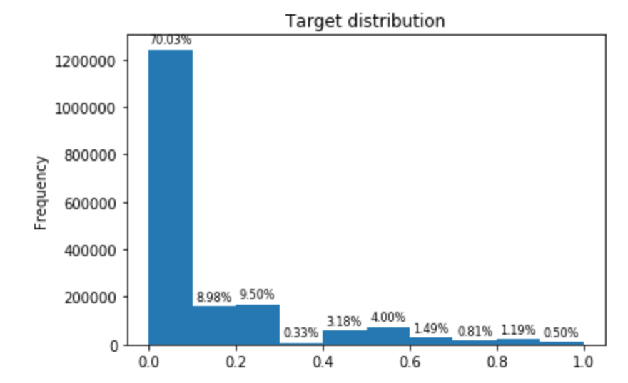
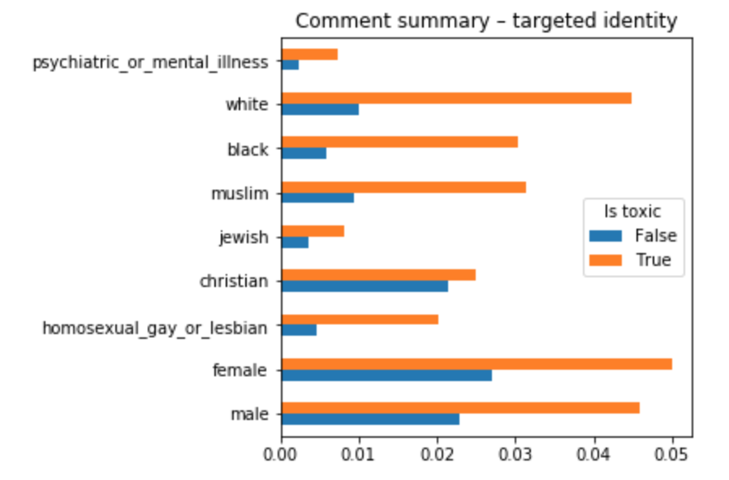
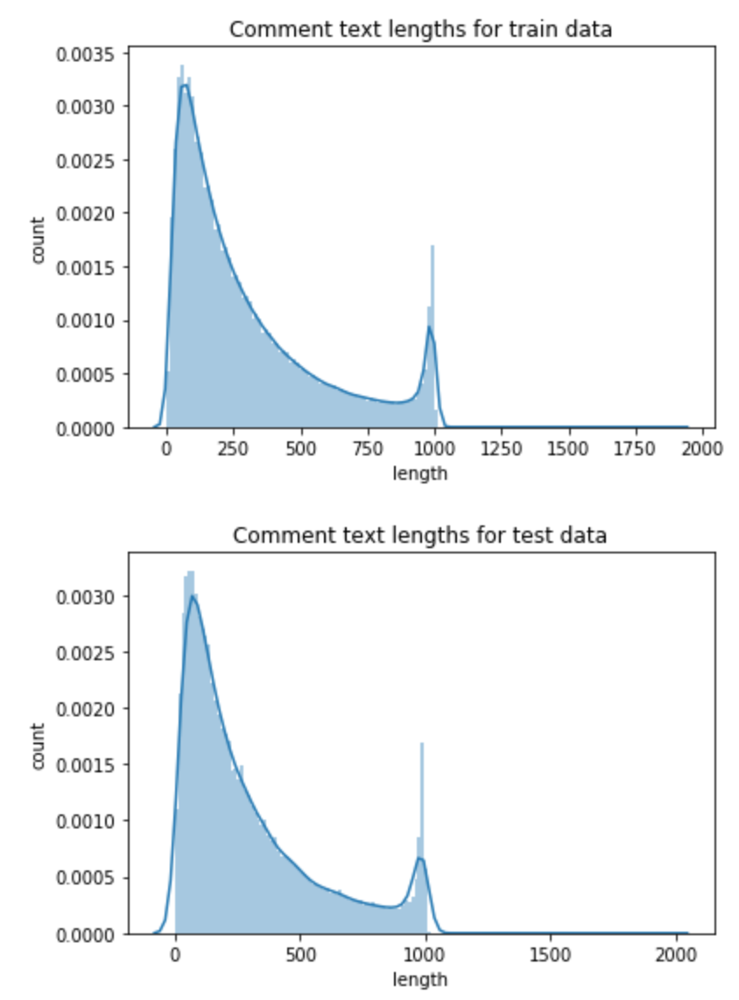

# CS-E4890 – Jigsaw Unintended Bias in Toxicity Classification

- [CS-E4890 – Jigsaw Unintended Bias in Toxicity Classification](#cs-e4890-%E2%80%93-jigsaw-unintended-bias-in-toxicity-classification)
  - [Abstract](#abstract)
  - [Introduction](#introduction)
    - [Scope of the project](#scope-of-the-project)
  - [Analysing the datasets](#analysing-the-datasets)
    - [Cleaning up the data](#cleaning-up-the-data)
    - [Exploratory data analysis (EDA)](#exploratory-data-analysis-eda)
  - [Methods](#methods)
    - [Preprocess the data](#preprocess-the-data)
    - [Convolutional Neural Network (CNN)](#convolutional-neural-network-cnn)
    - [Long short-term memory (LSTM)](#long-short-term-memory-lstm)
    - [Combination of CNN and LSTM](#combination-of-cnn-and-lstm)
  - [Results](#results)
  - [Conclusions](#conclusions)
  - [References](#references)
  - [Appendix](#appendix)
  - [A. Imports](#a-imports)
    - [B. Columns](#b-columns)
    - [C. Spelling replacements](#c-spelling-replacements)
    - [D. Utility functions](#d-utility-functions)
    - [E. Visualization functions](#e-visualization-functions)
    - [F. Training](#f-training)
    - [G. Obtaining results](#g-obtaining-results)

\pagebreak

## Abstract

This paper describes the process of developing a neural network for a natural language processing (NLP) problem, a toxicity classification problem by Jigsaw.

The networks discussed are Convolution Neural Networks (CNN), Long Short-Term Memory (LSTM), and a combination of CNNs and LSTMs (C-LSTM). Originally, we thought of implementing a Gated Recurrent Unit (GRU), but instead we decided to use a combination of CNNs and LSTMs.

In the end we achieved better results than we first anticipated considering the fact that we tried to minimize the number of external utilities. Our best model was achieved using Bi-directional LSTM, the accuracy of this model was `0.91510`.

\pagebreak

## Introduction

The goal of this project is to attempt to solve a toxicity classification problem in the field of NLP. The approach used in this paper discusses neural networks and how they perform for this classification task. We discuss our reasoning, expectations and thoughts of the execution of our project. The toxicity classification problem at hand is due to the increasing amount of discussion platforms such as, comment feeds on live broadcasts and other fora. Some live broadcasts are targeted for wide audiences and need efficient, near instantanious, profanity filtering.

Typically, the issue with naïve profanity filtering is that it focuses too heavily on individual words while ignoring the context. It was studied that names of the frequently attacked identities were automatically accociated to toxicity by machine learning (ML) models, even if the individual(s) themselves, or the context, were not offensive. (Kaggle. 2019)

To reach the goal of the project, a proper classifier, we have divided the workload into three sections: Analyzation and manipulation of the datasets, design and construction of the networks, and reporting of the attained results. At the beginning we will do appropriate research to design the network. However, some parts of the network will be designed on the go, through trial and error.

In the appendices, you can find code blocks that are not directly related to the structure of the neural networks. These include; import statements, spelling replacement and relevant columns dictionaries, visualization and utility functions, the training algorithm we used for all of our network variants, and lastly algorithm for obtaining the results.

### Scope of the project

This paper is intented to describe the project for a Kaggle competition ([Jigsaw Unintended Bias in Toxicity Classification](https://www.kaggle.com/c/jigsaw-unintended-bias-in-toxicity-classification/ "Competition page")). The competition provides a grader that evaluates the quality of the resulting model. The overall assessment of the goodness of our model is deviced with an overall Area under the curve (AUC) Receiver operating characteristic curve (ROC) test and with multiple other submetrics. The submetrics are:

- Bias AUCs: To prevent unintended bias we use three specific subsets of the test for each identity, attemping to capture all the aspects of unintended bias.
  - Subgroup AUC: Focuses on specific identity subgroup
  - Background Positive, Subgroup negative (BSPSN) AUC: Evaluates only non-toxic examples for an identity and toxic examples without the identity
  - Background Negative, Subgroup positive (BNSP) AUC: The test set is restricted opposite to BSPN, only featuring examples of toxic examples of an identity and non-toxic examples without the identity
- Generalized Mean of Bias AUCs
  - Calculates the combination of the per-identity Bias AUCs into one overall measure with:

$$M_p(m_s) = \left(\frac{1}{N} \sum_{s=1}^{N} m_s^p\right)^\frac{1}{p}$$

where:

- $M_p$ = the pth power-mean function
- $m_s$ = the bias metric m calulated for subgroup s
- $N$ = number of identity subgroups

Lastly, after obtaining the overall AUC and the General Mean of Bias AUCs the calculation of the final model is done with formula:

$$score = w_0 AUC_{overall} + \sum_{a=1}^{A} w_a M_p(m_{s,a})$$

where:

- $A$ = number of submetrics (3)
- $m_s,a$ = bias metric for identity subgroup $s$ using submetric $a$
- $w_a$ = a weighting for the relative importance of each submetric; all four $w$ values set to 0.25

None of this is relevant until we have inspected and manipulated the data by different methods (e.g. converting that's -> that is). After analyzing the data, we hope to get some instincts on how to construct the networks. After the data manipulation is done, we will feed it to a neural network hoping for results. That is, the scores of the AUCs above.

Our initial plan is to use CNNs because they have been shown effective for various NLP problems. In addition to CNNs, we will implement a LSTM or a GRU network (another variation of RNN), and compare those results to the results obtained by CNNs.

\pagebreak

## Analysing the datasets

The data originates from year 2017, when the Civil Comments platform shut down and published their ~2m public comments making them available for researchers. Each item in the dataset has one primary attribute for the toxicity, `target`, indicating a goal value that the models should try to achieve. The trained model should then predict the `target` toxicity for the test data.

The training data originally consisted of `1804874` sentences. We managed to reduce this amount by `30578` rows, which brought the number of total rows to `1774296`. This process is later described in this document. The sentences had altogether 1670966 individual words, which we managed to reduce by 1354991 (81.09%) words.

In addition to `target`, there are several subtypes of toxicity. These are not supposed to be predicted by the model, but they are for providing additional avenue for future research. The subtype attributes are:

- severe_toxicity
- obscene
- threat
- insult
- identity_attack
- sexual_explicit

Along with these, it is notable that the attribute `parent_id` could be used for training a model. The reason for this is that we think that the neural network should mark some difference between comments that start a thread versus ones that do not.

The labels for the training data were obtained by displaying the comments to several annotators, which then rated the toxicity of each comment. The `target` column is aggregated from the subtypes of toxity, and we only use this column in our approach.

Some of the comments have a label for identity, which were attained in a similiar manner to toxicity labels. We were interested only of the identity attributes, which had more than `500` occurancies in the training data set. Each identity represents that *is mentioned* in the comment. The identities we are interested, as the ones used in the validation of the model, are:

- male
- female
- homosexuality_gay_or_lesbian
- christian
- jewish
- muslim
- black
- white
- psychiatric_or_mental_illness

Identities we dropped were: *transgender, other_gender, heterosexual, bisexual, other_sexual_orientation, hindu, buddhist, atheist, other_religion, asian, latino, other_race_or_ethnicity, physical_disability, intellectual_or_learning_disability, other_disability*

### Cleaning up the data

The were some operations we wanted to do to the dataset before training models on it. For example, there are some reoccurring special characters and the dataset contains duplicate comments with same content. However, the different comments may have been labelled with different targets or subgroups (Kaggle, 2019).

The operations we do for the datasets are; lowercase the words, remove the non-alpha characters, uniform spelling, fill empty values with 0 and preprocess the data so that we obtain a much smaller, more compact, sets for the training and validation. In case of duplicate comments, we merged the instances of each distinct comment, taking average over the labels. The functions describing the cleanup proces can be found in the [utility functions](#d-utility-functions) of the appendix.

```python
print("reading train data...")
train_data = read_cleaned_file(
    'train',
    'train_cleaned',
    relevant_columns # discards all other columns
)
print_cleanup_summary("train_cleaned")


print("reading test data...")
test_data = read_cleaned_file(
    'test',
    'test_cleaned',
    drop_duplicates = False # we don't want to drop duplicates, as every comment in test_data have to be labelled
)
print("The test data is read to memory")
```

> reading train data...

> The original data was reducted by 30578 rows (1.69%) and by 1354991 words (81.09%)

> reading test data...

> The test data is read to memory

### Exploratory data analysis (EDA)

In this section we will attempt to find further details of the data with some basic exploratory data analysis (EDA) techniques. This includes, example given, data distribution tables and visualizations.

Now that we have a cleaned version of the datasets we can further analyze and visualize them. Lets first look at the binary distribution of toxic and non-toxic inputs in the dataset. A message is toxic whenever its toxicity (attribute `target`) is larger than the data toxicity threshold (`.5`).

```python
def calculate_binary_distribution(data):
    # Calculate percentage of toxic and non-toxic entries
    toxic = 0
    non_toxic = 0
    for value in data["target"]:
        if value >= .5:
            toxic += 1
        else:
            non_toxic += 1
    data_count = len(data)
    return (toxic / data_count, non_toxic / data_count)
```

```python
count_toxic, count_non_toxic = calculate_binary_distribution(train_data)

# Print binary toxicity distribution
print("Amount of toxic comments {:.2f}% and non-toxic comments {:.2f}%.".format(
    count_toxic,
    count_non_toxic
))
```

> Amount of toxic comments 0.05% and non-toxic comments 0.95%.

As we can see, most of the sentences are non-toxic. It might then be possible to flag a sentence as toxic by just having a few specific word pairings within each identity group.

Next, a generic visualization showing the distribution of toxic and non-toxic messages in the dataset.

```python
visualize_target_distribution(train_data)
```



Then toxicity distributions by identity groups.

```python
visualize_toxicity_by_identity(train_data, identity_columns)
```



Below is an example presenting some very toxic comments with Jewish identity (reader discretion adviced).

```python
train_data.sort_values(by=["target", "jewish"], ascending=False).head(10)
```

|id|comment_text|
|---|---|
|23550| a  misleading technicality   b  put aside afrikaner for a moment and consider the broader point   c   i  such heavily concentrated wealth at the top indicates economic disease   ii  their race indicates a persistent racial problem   1  you are defending the bantu education system    2  i am not black  i am white monopoly capital  you would think afrikaners would do better out of apartheid than 3 in the top 16   perhaps they were too busy blaming the english for their lack of will power     or the jews    or the arabs    or is that ignorant and racist |
|542152|how many jewish majority countries are there in the world  one  with a total population of barely 10 million  and that country is a constitutional democracy  with full rights and freedoms for all its people  including those who are not jewish  sorry  your analogy is ridiculous |
|553967|hysterical over reaction exactly describes the targeted liberal islamophobia motion rather than encompassing all religions        this just after imams in canada were discovered targeting their hatred and calls to kill jews |
|796138|it is incomprehensible that anyone  other than residences of israel  can make an intelligent and informed comment on the jewish state  of course it is not a democracy any more than any other arab state in the region and rightfully so  it has provided all residence considerable freedoms and vastly more  rights  than iran  saudi arabia and palestine to name a few  the notion of  trampling on anyones human rights  is nothing but an ironic joke given the attributes of the enemy states trying to destroy israel and if gaza was not a warning for you  i am not sure you are paying attention  john kerry is the progressives buffoon leading a band of useful idiots on the road to destroy israel |
|963101|news flash bacon is not kosher  jews and their muslims brothers do not eat pork |
|1049861|one could effectively argue that islamic state  with it is ideology surrounding women  jews  gays  and the separation of religion and state is far right movement  but it might be simpler to stop all the hair splitting and take action against those inciting violence and hatred from any ideological basis  when people want to continually bang on about one particular hate group and never mention or rationalize the actions of another you can often hear a little axe grinding in the background |
|1282557|that is silly  very little of modern life  which is regulated by the constitution was directly addressed by that document  what you are claiming is that religion takes precedence over any other consideration  sort of a christian sharia  amirite  so if jews are considered as christ killers  is it o k  to discriminate against them  if a muslim decides to discriminate against women  it that o k  |
|1399307|there are about 100 verses in the quran  the holy book of the religion of islam  that call for the destruction of jews  christians and non believers  infidels   there are dozens of groups of muslims  including hamas  hezbollah  islamic jihad  the taliban  al qaeda  al shabaab  boko haram  abu sayyaf  daesh  isis il   etc  etc  etc   that follow islam and the many verses in the quran that call for the destruction of jews  christians and non believers  i hope wente and the muslims in canada think muslims who follow the violent verses in the quran have no place in canada |
|1683859|yeah  socialists want to exterminate jews  like that jewish guy bernie wants to do  i would say the level of ignorance and lack of education is comical  except it is so detrimental to our country  read a book sometime |
|297088|cannot wait for his next meltdown when someone does his genealogy and he finds out his grandma is jewish and his great granddad is black |

```python
visualize_comment_length(train_data, "Comment text lengths for train data")
visualize_comment_length(test_data, "Comment text lengths for test data")
```



As we can see from the illustrations above, the two datasets have very similar shape and the model should hence yield good results for both the training and the test dataset.

\pagebreak

## Methods

A prime example of a text classification problem is detection of spam or toxic sentences, like the task at hand. Toxicity detection from text is a Supervised Machine Learning task that focuses in labelled datasets containing sequences and or single words. The purpose of our algorithm is to train a classifier that can label the sets of words (comment content) by its toxicity.

Typically the text classification pipeline contains the following components:

- Training data: Input text for the model
- Feature vector: A vector that describe the input texts, in some charasteristic or multiple ones
- Labels: The classes that we plan to predict with our trained model
- Algorithm: A machine learning algorithm that is used to classify the inputs
- Model: The result of the training, this will perform the label predictions (Maheshwari, 2018)

Some studies suggest to utilize a combination of C-BiLSTM to achieve a high performing classifier for a test very similar to ours (Yenala et al., 2018).

More generally, use of RNNs, LSTM being an example of these, in NLP is an intuitive and an advisable method. RNNs exceed in grammar learning. This is mainly because their ability to process sequences of inputs, such as, in the case of toxicity filtering, sequences of words.

To ensure the reproducibality of the results, we initially seed torch, numpy and python with 0.

```python
random.seed(0)
np.random.seed(0)
torch.manual_seed(0)
```

The models presented here, are the ones that achieved the highest scores within each architecture in our trials.

### Preprocess the data

Before feeding the comment contents to the model, we want to perform integer encoding of its contents. We do this by using tokenizer provided by `Keras` -library. The tokenizer transforms text content into sequence of integers. Doing this allows us to later on implement an embedding layer that we need for processing text data. (Keras Documentation, 2018)

The purpose of the word embedding is to obtain a dense vector representation of each word. This vector is then capable of, example given, capturing the context of that word, the semantic and syntactic similarity and relation to other words (Ganguly et al., 2015).

```python
train_x = train_data["comment_text"]
train_y = train_data[["target"] + identity_columns]

sentences = train_x.append(test_data["comment_text"]) # get all sentences present in training and test data

tokenizer = preprocessing.text.Tokenizer()
tokenizer.fit_on_texts(sentences)
```

### Convolutional Neural Network (CNN)

CNNs are feed-forward artificial neural networks. They use a variation of multilayer perceptrons that offer minimal preprocessing. Use of CNNs in NLP is a relatively new technique as previously their primary use case was in computer vision. Use of CNN models for NLP tasks have shown to be effective in semantic parsing (Yih et al., 2014), search query retrieval (Shen et al., 2014), sentence modeling (Kalchbrenner et al., 2014), and other, more traditional NLP tasks (Collobert et al., 2011).

Harrison Jansma recommends in his Medium article not to use Dropout (Harrison, 2018). Dropout is a technique for preventing overfitting in neural networks by randomly dropping units (and their connections) from neural network during training (Srivastana et al., 2014.). According to Jansma, there are two main reasons why use of dropout is declining in CNNs. First, use of dropout is less effective in regularizing convolutional layers in contrast to batch normalization. Secondly, dropout is good for fully connected layers but more recent architectures have moved away from these fully-connected blocks. Hence, it is not the tool for these architectures.

Our network consists of following:

1. Embedding layer
  * The output will be of size $M*N*N$, where $M$ is batch size and $N$ is the length of the longest sentence.
1. 3x convolutional layers
  * The output size of each is calculated by $\left\lfloor\frac{N + 2 \times padding - dilation \times (kernelsize - 1) - 1}{stride} + 1\right\rfloor$, where $N$ is the input size. We did not alter the dilation at all, and used the default value which is 1.
1. Before feeding the output of convolutional layers to linear layers, we will take average pooling over it
1. 2x linear layers
  * ELU activation function in between. We won't apply activation function to the last layer, as it is applied after.

```python
class CNNNetwork(nn.Module):
    def __init__(self, max_len, vocab_size, hidden_size, out_size):
        super(CNNNetwork, self).__init__()
        self.embedding = nn.Embedding(vocab_size, max_len)

        self.conv = nn.Sequential(
            nn.Conv1d(max_len, hidden_size, 3, padding = 1),
            nn.BatchNorm1d(hidden_size),
            nn.ELU(),
            nn.Conv1d(hidden_size, hidden_size, 3, padding = 1),
            nn.BatchNorm1d(hidden_size),
            nn.ELU(),
            nn.Conv1d(hidden_size, hidden_size, 3, padding = 1),
            nn.BatchNorm1d(hidden_size),
            nn.ELU(),
        )

        in_size = get_conv_out_size(max_len, 3, 1, 1)
        in_size = get_conv_out_size(in_size, 3, 1, 1)
        in_size = get_conv_out_size(in_size, 3, 1, 1)

        self.net = nn.Sequential(
            nn.Linear(in_size, hidden_size * 2),
            nn.ELU(),
            nn.Linear(hidden_size * 2, out_size)
        )

    def forward(self, x):
        embedding = self.embedding(x)
        out = self.conv(embedding)

        out = torch.mean(out, 1) # global average pooling

        return self.net(out)
```

### Long short-term memory (LSTM)

LSTM is a recurrent network architecture in conjunction with an efficient, gradient-based learning algorithm. All together LSTM is able to store information over extended time intervals while resolving problems associated with backpropagation through time (BPTT) and real-time recurrent learning (RTRL). (Hochreiter and Schmidhuber, 1995)

The greatest advantage of using LSTM for NLP is its ability to handle noise, distributed representations, and continuous values. LSTMs ability to function without a finite number of states enables it to work for any sequence lengths and items in the sequence, as long as these are preprocessed to numbers. (Hochreiter and Schmidhuber, 1995)

Our LSTM network consists of embedding and linear layers along with the LSTM defined by PyTorch. The PyTorch LSTM applies a multi-layer long short-term memory RNN to the input sequence. The computation, that the layer does, for each input sequence is:

$i_t = \sigma(W_{ii}x_t + b_{ii} + W_{hi}h_{(t-1)} + b_{hi})$

$f_t = \sigma(W_{if}x_t + b_{if} + W_{hf}h_{(t-1)} + b_{hf})$

$g_t = \tanh(W_{ig}x_t + b_{ig} + W_{hg}h_{(t-1)} + b_{hg})$

$o_t = \sigma(W_{io}x_t + b_{io} + W_{ho}h_{(t-1)} + b_{ho})$

$c_t = f_t * c_{(t-1)} + i_t * g_t$

$h_t = o_t * \tanh(c_t)$

where $h_t$ is the hidden state at time $t$, $c_t$ is the cell state at time $t$, $x_t$ is the input time at $t$, $h_{(t-1)}$ is the hidden state of the layer at time $t-1$ or the initial hidden state at time $o$, and $i_t$, $f_t$, $g_t$ and $o_t$ are the input, forget, cell, and output gates, respectively. $\sigma$ is the sigmoid function, and $*$ is the Hadamard product. (PyTorch Documentation, 2019)

```python
class LSTMNetwork(nn.Module):
    def __init__(self, max_len, vocab_size, hidden_size, out_size):
        super(LSTMNetwork, self).__init__()
        self.embedding = nn.Embedding(vocab_size, max_len)

        self.pre = nn.Sequential(
            nn.Linear(max_len, hidden_size * 2),
            nn.Dropout(.20), # dropout to counter over-fitting
            nn.ELU(),
            nn.Linear(hidden_size * 2, max_len)
        )

        self.lstm = nn.LSTM(
            input_size = max_len,
            hidden_size = hidden_size,
            bidirectional = True,
            batch_first = True,
            num_layers = 4
        )

        self.net = nn.Sequential(
            nn.Linear(hidden_size * 4, hidden_size * 2),
            nn.ELU(),
            nn.Linear(hidden_size * 2, out_size)
        )

    def forward(self, x):
        embedding = self.embedding(x) # output of size M*N*N where M is batch size and N max_len
        out = self.pre(embedding) # output size will be same as the input size
        out, _ = self.lstm(embedding) # M*N*2*H, where M is batch size N max_len, H hidden_size

        out = torch.cat((
            torch.max(out, 1)[0], # global max pooling
            torch.mean(out, 1) # global average pooling
        ), 1) # The output size will be M*2N where M is batch size and N is input size (in this case 2*hidden_size -> N = 4*hidden_size)

        return self.net(out)
```

### Combination of CNN and LSTM

A combination network of Convolutional Neural Network and LSTM. An award winning model, Convolutional Bi-directional LSTM (C-BiLSTM), encouraged us to try our own variant of the aforesaid model. The structure differs, but the basic idea is the same; combining strenths of the two architectures. The convolutional layer extracts the feature representations of each word, and the BLSTM layer captures various sequential patterns in the entire query and outputs a richer representation encoding of them (Yenala et al., 2018).

```python
class CNNLSTMNetwork(nn.Module):
    def __init__(self, max_len, vocab_size, hidden_size, out_size):
        super(CNNLSTMNetwork, self).__init__()
        self.embedding = nn.Embedding(vocab_size, max_len)

        self.conv = nn.Sequential(
            nn.Conv1d(max_len, hidden_size, 3, padding = 1),
            nn.BatchNorm1d(hidden_size),
            nn.ReLU(),
            nn.Conv1d(hidden_size, hidden_size, 3, padding = 1),
            nn.BatchNorm1d(hidden_size),
            nn.ReLU(),
            nn.Conv1d(hidden_size, hidden_size, 3, padding = 1),
            nn.BatchNorm1d(hidden_size),
            nn.ReLU(),
        )

        self.lstm = nn.LSTM(
            input_size = max_len,
            hidden_size = hidden_size,
            bidirectional = True,
            batch_first = True,
            num_layers = 2
        )

        self.net = nn.Sequential(
            nn.Linear(hidden_size * hidden_size * 2, hidden_size * 2),
            nn.ELU(),
            nn.Linear(hidden_size * 2, out_size)
        )

    def forward(self, x):
        embedding = self.embedding(x)
        out, _ = self.lstm(self.conv(embedding))

        out = torch.flatten(out, start_dim=1)

        return self.net(out)
```

### Training the models

```python
max_len = len(sentences.max())

# Model is one of the networks declared above
lstm = Model(
  max_len,
  len(tokenizer.word_index) + 1, # vocabularity size
  128, # hidden size
  len(train_y.columns) # output size
).to(device)
# Criterion combines BCELoss and sigmoid layer, more numerically stable
# than embedding sigmoid directly into the network
# as torch takes advantage of the log-sum-exp trick for numerical stability.
criterion = nn.BCEWithLogitsLoss(reduction="mean")

# We only used Adam optimizer with default parameters (https://pytorch.org/docs/stable/_modules/torch/optim/adam.html)
optimizer = optim.Adam(lstm.parameters(), lr=0.001)

# Scheduler alters the learning rate after each epoch. found optimal reduction of .6**epoch count by observing convergence of the loss
scheduler = torch.optim.lr_scheduler.LambdaLR(optimizer, lambda epoch: .6 ** epoch)
```

\pagebreak

## Results

Below are the results of the use of the above networks with optimal found parameters and network structures. However, due to limited time reserved to project and computational resources, we were only able to try a handful of alterations.

| model | activation fn | score   | lr coefficient | dropout | hidden size | lstm_layers |
| --- | ------------- | ------- | -------------- | ------- | ----------- | ----------- |
| LSTM | ELU           | 0.91559 | .6             | .25     | 128         | 4           |
| CNN | ReLU          | 0.89617 | .5             | .25     | 128         | 2           |
| CNNLSTM | ReLU          | 0.90599 | .7             | .25     | 128         | 4           |

Unlike originally intended, we did not use GRU network at all. This was due to the time limitations set to the project.

\pagebreak

## Conclusions

In retrospect, we could have tried splitting a chunk of the training data to be used as validation data to train the models. In addition to the need of manually adjusting the learning rate to counter overfitting, this approach would have saved us from futile submission attempts as the competition limited submissions per day to five.

The decisions we made were good, and the results we gained were not awful, but it would have been nice to have had time to try `Adam` optimizer with different configuration parameters. In addition to this, exploring with a different optimizer would have been nice. Use of premade embedding, such as GloVe, which is an embedding of Wikipedia 2014 and Gigaword word libraries, could have made a large difference in contrast to our own embedding. This is because GloVe embedding is made so that the words take into consideration relations with each other and the other context. (Pennington J. et al. 2014)

We also had some issues with computational resources, as we hit memory caps quite fast. We resolved this issue by adjusting the network structure and splitting the test data into chunks before feeding it to the network to obtain labels for the test data.

Originally, we thought of using the `parent_id` attribute, but in the end we decided against it, due to pressure of time. Also, the data contained metadata from Civil Comments: such as `funny`, `sad`, `likes` and `dislikes`. These subtypes were not utilized in any way, but further research could benefit from these greatly.

\pagebreak

## References

Collobert, R., Weston, J., Bottou, L., Karlen, M., Kavukcuoglu, K., Kuksa, P., 2011. Natural Language Processing (Almost) from Scratch. Journal of Machine Learning Research 12:2493-2537.

Ganguly, D., Roy, D., Mitra, M., Jones G. J. 2015. Word Embedding Based Generalized Language Model for Information Retrieval. In Proc. SIGIR 2015, pages 795–798.

Harrison J. 2018. Don't Use Dropout in Convolutional Networks. Medium.
Hochreiter, S. and Schmidhuber, J. 1995. Long short term memory. München: Inst. für Informatik.

Kalchbrenner, N., Grefenstette, E., Blunsom, P., 2014. A Convolutional Neural Network for Modelling Sentences, In Proceedings of ACL 2014.

Keras. 2018. Text Processing - Keras Documentation. Retrieved from https://keras.io/preprocessing/text/.

Maheshwari, A., 2018. Report on Text Classification using CNN, RNN & HAN. Retrieved from https://medium.com/jatana/report-on-text-classification-using-cnn-rnn-han-f0e887214d5f/.

Shen, Y., He, X., Gao, J., Deng, L., Mesnil, G. 2014. 2014. Learning Semantic Representations Using Convolutional Neural Networks for Web Search. In Proceedings of WWW 2014.

Srivastava, N., Hinton, G., Krizhevsky, A., Sutskever, I., Salakhutdinov, R., 2014. Dropout: A Simple Way to Prevent Neural Networks from Overfitting. Journal of Machine Learning Research 15:1929-1958.

Torch Contributors. 2018. PyTorch Documentation. Retrieved from https://pytorch.org/docs/stable/index.html/.

Yenala, H., Jhanwar, A., Chinnakotla, M.K. et al. Int J Data Sci Anal (2018) 6: 273. Retrieved from https://doi.org/10.1007/s41060-017-0088-4

Yih, W., He, X., Meek, C. 2014. Semantic Parsing for Single-Relation Question Answerings of ACL 2014.

Pennington, J., Socher, R., D. Manning. C. D. 2014. GloVe: Global Vectors for Word Representation.

\pagebreak

## Appendix

### A. Imports

```python
import numpy as np # linear algebra
import pandas as pd # data processing, CSV file I/O
import re # regexes
import matplotlib.pyplot as plt # plotting
import os
import time

from keras import preprocessing
import torch
import torch.utils.data
from torch import nn
from torch.nn import functional as F
import torch.optim as optim

import os

device = torch.device("cuda:0")
torch.backends.cudnn.deterministic = True
```

### B. Columns

```python
identity_columns = [
    "male",
    "female",
    "homosexual_gay_or_lesbian",
    "christian",
    "jewish",
    "muslim",
    "black",
    "white",
    "psychiatric_or_mental_illness"
]

relevant_columns = [
    "id",
    "target",
    "comment_text"
] + identity_columns
```

### C. Spelling replacements

```python
replace_spelling = {
    "I'd": "I would",
    "I'll": "I will",
    "I'm": "I am",
    "I've": "I have",
    "ain't": "is not",
    "aren't": "are not",
    "can't": "cannot",
    'colour': 'color',
    "could've": "could have",
    "couldn't": "could not",
    "didn't": "did not",
    "doesn't": "does not",
    "don't": "do not",
    "hadn't": "had not",
    "hasn't": "has not",
    "haven't": "have not",
    "he'd": "he would",
    "he'll": "he will",
    "he's": "he is",
    "here's": "here is",
    "how's": "how is",
    "i'd": "i would",
    "i'll": "i will",
    "i'm": "i am",
    "i've": "i have",
    "isn't": "is not",
    "it'll": "it will",
    "it's": "it is",
    "let's": "let us",
    "might've": "might have",
    "must've": "must have",
    "she'd": "she would",
    "she'll": "she will",
    "she's": "she is",
    "shouldn't": "should not",
    "that's": "that is",
    'theatre': 'theater',
    "there's": "there is",
    "they'd": "they would",
    "they'll": "they will",
    "they're": "they are",
    "they've": "they have",
    'travelling': 'traveling',
    "wasn't": "was not",
    "we'd": "we would",
    "we'll": "we will",
    "we're": "we are",
    "we've": "we have",
    "weren't": "were not",
    "what's": "what is",
    "where's": "where is",
    "who'll": "who will",
    "who's": "who is",
    "who've": "who have",
    "won't": "will not",
    "would've": "would have",
    "wouldn't": "would not",
    "you'd": "you would",
    "you'll": "you will",
    "you're": "you are",
    "you've": "you have"
}
```

### D. Utility functions

```python
def clean_sentence(sentence):
    return re.sub(
        "[^a-z\d\s]", # Remove all non-alphanumeric or space characters from comment text
        " ",
        " ".join(map(
            lambda word: replace_spelling[word] if word in replace_spelling else word,
            sentence.lower().split()
        )).replace("'", "") # ... and drop all remaining ' -marks (as we do not want to replace them with spaces)
    )

def create_cleaned_file(from_name, to_name, cols, drop_duplicates):
    """Create a cleaned file from a file"""
    data = pd.read_csv(
        "../input/jigsaw-unintended-bias-in-toxicity-classification/{}.csv".format(from_name),
        usecols=cols,# use only relevant columns, as specified before in the notebook
    )
    data.set_index("id", inplace=True)

    _, original_word_count = get_individual_words(data["comment_text"])

    data["comment_text"] = data["comment_text"].transform(clean_sentence)
    data = data.fillna(0) # fill empty values with 0

    if drop_duplicates:
        cleaned_words = set()
        data["comment_text"].str.split().apply(cleaned_words.update)

        # Write summary file of the cleanup process
        pd.DataFrame({
            "previous_word_count": [original_word_count],
            "cleaned_word_count": [get_individual_words(data["comment_text"])[1]],
            "previous_row_count": [len(data)],
            "cleaned_row_count": [data["comment_text"].nunique()]
        }).to_csv("./"+to_name+"_summary.csv")

        data = data.groupby("comment_text").mean().reset_index()
    data.to_csv("./"+to_name+".csv", index_label="id")

def print_cleanup_summary(filename):
    # read cleanup summary from saved file
    cleanup_summary = pd.read_csv("./"+filename+"_summary.csv")
    initial_row_count, initial_word_count = cleanup_summary.loc[
        0,
        ["previous_row_count", "previous_word_count"]
    ]
    cleaned_row_count, cleaned_word_count = cleanup_summary.loc[
        cleanup_summary.index[-1],
        ["cleaned_row_count", "cleaned_word_count"]
    ]

    print("The original data was reducted by {} rows ({:.2f}%) and by {} words ({:.2f}%)".format(
        initial_row_count - cleaned_row_count,
        100 * (1 - cleaned_row_count / initial_row_count),
        initial_word_count - cleaned_word_count,
        100 * (1 - cleaned_word_count / initial_word_count)
    ))

def read_cleaned_file(from_name, to_name, cols = None, drop_duplicates = True):
    if not os.path.isfile("./{}.csv".format(to_name)):
        create_cleaned_file(from_name, to_name, cols, drop_duplicates)
    # read data from cleaned data file if not already set
    return  pd.read_csv("./{}.csv".format(to_name))

def get_individual_words(col):
    assert hasattr(col, "str") and hasattr(col.str, "split")
    words = set()
    col.str.split().apply(words.update)

    return words, len(words)

def get_conv_out_size(in_size, kernel_size, stride, padding, dilation = 1):
  return (in_size + 2 * padding - dilation * (kernel_size - 1) - 1) // stride + 1

def count_more_than_equal(data, attr, threshold):
    try:
        threshold = float(threshold)
        count = 0
        for value in data[attr]:
            if isinstance(value, str):
                value = len(value)
            if value >= threshold:
                count += 1
        return count
    except ValueError:
        return 0

# threshold = 1250
# print("Amount of {} or more character sentences.\ntrain data: {}\ntest data: {}".format(
#     threshold,
#     count_more_than_equal(train_data, "comment_text", threshold),
#     count_more_than_equal(test_data, "comment_text", threshold)
# ))
```

### E. Visualization functions

```python
import matplotlib.pyplot as plt
import pandas as pd
import seaborn as sns
import numpy as np


def visualize_toxicity_by_identity(data, columns):
    """Visualizes the toxicity for each identity type"""
    data.groupby(data["target"] >= .5).mean()[columns].T \
        .plot.barh()

    plt.legend(title="Is toxic")

    plt.tight_layout()
    plt.title("Comment summary – targeted identity")
    plt.show()


def visualize_target_distribution(data, bins = 10):
    """
    Visualizes the target distribution
    - A comment is considered non-toxic if target is less than .1
    - Comments between .1 to .5 are considered toxic to some annotators
    - Comments above .5 are toxic.
    """
    plot = data["target"].plot(kind="hist", bins=bins)

    ax = plot.axes

    for p in ax.patches:
        ax.annotate(
            f'{p.get_height() * 100 / data.shape[0]:.2f}%',
            (p.get_x() + p.get_width() / 2., p.get_height()),
            ha="center",
            va="center",
            fontsize=8,
            color="black",
            xytext=(0,7),
            textcoords="offset points"
        )

    plt.title("Target distribution")
    plt.show()


def visualize_comment_length(data, title):
    """Visualizes the comment length distribution"""
    data["comment_text_len"] = data["comment_text"].apply(len)
    ax = sns.distplot(
        data["comment_text_len"],
        bins=150
    )
    ax.set(xlabel="length", ylabel="count")

    plt.title(title)
    plt.show()
```

### F. Training

```python
log_nth = 200
epochs = 4

print("training model...")

train_tokens = preprocessing.sequence.pad_sequences(
    tokenizer.texts_to_sequences(train_x),
    maxlen = max_len,
)

train_data_tensor = torch.tensor(train_tokens, dtype=torch.long).to(device)
train_labels_tensor = torch.tensor(train_y.values, dtype=torch.float32).to(device)

train_loader = torch.utils.data.DataLoader(
    torch.utils.data.TensorDataset(train_data_tensor, train_labels_tensor),
    batch_size=512,
    shuffle=True
)

for epoch in range(epochs):
    epoch_start = time.time()
    scheduler.step()
    lstm.train() # set lstm to train mode
    total_loss = 0
    for i, (x, labels) in enumerate(train_loader, 1):
        x.to(device)

        optimizer.zero_grad()

        out = lstm(x)

        loss = criterion(out, labels)
        total_loss += loss.item()
        loss.backward()

        optimizer.step()

        if i % log_nth == 0:
            print(total_loss / i, "{} / {} (batches ran / left to run)".format(i, len(train_loader)))

    print(
        "epoch: {}/{}".format(epoch + 1, epochs),
        "loss: {:.4f}".format(total_loss / len(train_loader)),
        "time passed: {}".format(time.time() - epoch_start)
    )

# Save trained model state in case something goes south
print("saving model...")
torch.save(lstm.state_dict(), "./lstm.pd")
```

### G. Obtaining results

```python
lstm.eval() # set lstm to evaluation mode

test_tokens = preprocessing.sequence.pad_sequences(
    tokenizer.texts_to_sequences(test_data["comment_text"]),
    maxlen = max_len,
)

chunk_size = 1000 # too big chunk won't fit in memory, we hit our limit (locally) at 2000
chunks = len(test_tokens) // chunk_size + 1

predictions = pd.DataFrame(columns=["id", "comment", "prediction"])

for i in range(chunks):
    print("{}/{}".format(i + 1, chunks))
    first, last = i * chunk_size, min(len(test_tokens), (i + 1) * chunk_size)

    test_data_tensor = torch.tensor(test_tokens, dtype=torch.long)[first:last].to(device)

    predictions = pd.concat([
        predictions,
        pd.DataFrame({
            "id": test_data["id"][first:last],
            "prediction": torch.sigmoid( # need to take sigmoid, as the training applies BCEWithLogitsLoss
                lstm(test_data_tensor).detach().cpu() # need to copy the memory to cpu before casting to numpy array
            )[:, 0]
        })
    ], sort=False)

assert len(predictions) == len(test_tokens)
predictions[["id", "prediction"]] \
    .to_csv("./submission.csv", index=False)
```
